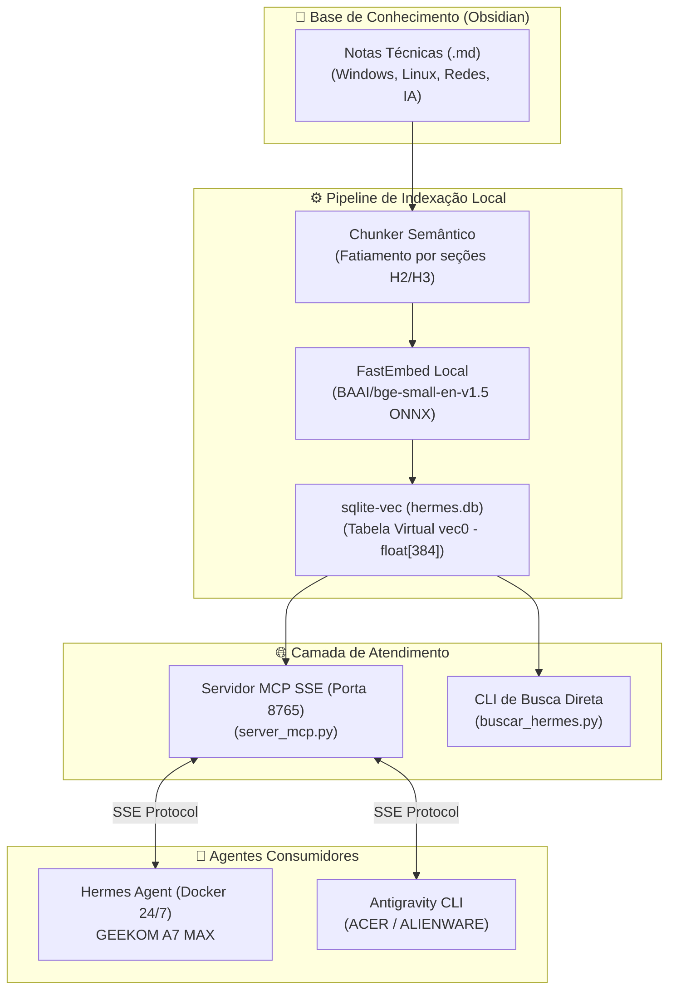

# 🧠 Arquitetura RAG Nativo Local: sqlite-vec, FastEmbed e MCP SSE

> [!NOTE]
> **Motor de Recuperação Aumentada por Geração (RAG) 100% Offline**  
> Implementação determinística de alta performance para consulta semântica de notas técnicas e procedimentos operacionais, eliminando dependência de APIs pagas de embeddings e reduzindo em até 95% o consumo de tokens de LLM.

---

## 🏛️ 1. Visão Geral da Arquitetura

O sistema de RAG (Retrieval-Augmented Generation) da Tríade foi projetado para atuar como o **cérebro compartilhado** entre o **Antigravity CLI** (nos laptops de desenvolvimento) e o **Hermes Agent** (residente 24/7 no host GEEKOM A7 MAX).



---

## 💎 2. Pilares de Engenharia

### A. Embeddings Locais de Alta Velocidade (`fastembed`)
- **Modelo**: `BAAI/bge-small-en-v1.5` executado via runtime ONNX.
- **Dimensões**: 384 dimensões em ponto flutuante de 32 bits (`float[384]`).
- **Performance**: Capaz de processar mais de 600 chunks de texto em menos de 3 minutos de CPU sem necessidade de GPU dedicada, com consumo zero de tokens ou requisições externas.

### B. Banco Vetorial Embarcado em C (`sqlite-vec`)
- Extensão nativa em linguagem C para o SQLite, trazendo capacidade vetorial sem a complexidade operacional de clusters como Pinecone, Weaviate ou Milvus.
- Indexação via tabela virtual:
  ```sql
  CREATE VIRTUAL TABLE IF NOT EXISTS vec_chunks USING vec0(
      chunk_id INTEGER PRIMARY KEY,
      embedding float[384]
  );
  ```
- **Busca por Distância Cosseno**:
  ```sql
  SELECT chunk_id, distance
  FROM vec_chunks
  WHERE embedding MATCH ? AND k = 5;
  ```

### C. Servidor Model Context Protocol (MCP) com Transporte SSE
- O servidor MCP expõe a ferramenta `buscar_conhecimento_homelab` através de protocolo SSE (Server-Sent Events) na porta `8765`.
- Permite que qualquer agente compatível consulte o acervo via chamada estruturada de ferramenta (*Tool Call*):
  ```json
  {
    "tool": "mcp__homelab_rag__buscar_conhecimento_homelab",
    "parameters": {
      "query": "Como configurar masquerade no RouterOS v7"
    }
  }
  ```

---

## 🛠️ 3. Operação e Manutenção

### Reindexação em Lote
Para reindexar todo o acervo após modificações nas notas:
```bash
python3 scripts/indexar_hermes.py
```

### Consulta Rápida via Terminal
Para testar a recuperação semântica sem iniciar um agente completo:
```bash
python3 scripts/buscar_hermes.py "recuperar arquivos sfc dism windows"
```

---

---

## 🔗 Notas Relacionadas
- [Benchmark Modelos MoE no GEEKOM](01_benchmark_modelos_moe_geekom.md) — Eficiência energética e hardware do nó central de IA.
- [Ranking Geral de Modelos de Linguagem](02_ranking_geral_modelos_llm.md) — Avaliação de capacidade e consumo de VRAM dos modelos.
- [Acesso ao Ollama via Terminal SSH](03_ollama_acesso_terminal_ssh.md) — Comunicação headless com instâncias locais de IA.
- [Guia Principal de Inteligência Artificial](README.md) — Índice principal de IA.
