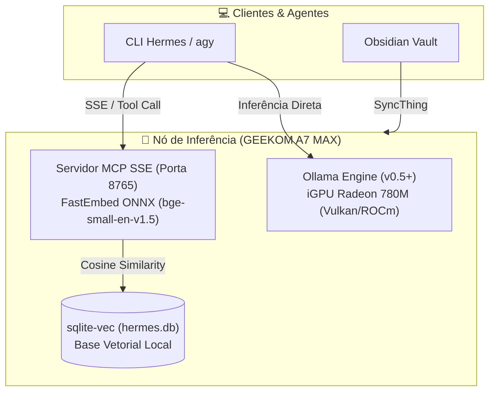

# 🤖 Inteligência Artificial Local & RAG Nativo

[-ED1C24?logo=amd&logoColor=white)](https://www.amd.com)

[-purple)](https://modelcontextprotocol.io)

Repositório público de engenharia e curadoria técnica com foco em **Inteligência Artificial Local**, **inferência on-device**, **benchmarks de modelos SLM/LLM/MoE** e **arquitetura de RAG nativo (Retrieval-Augmented Generation)** de ultra-baixa latência e consumo mínimo de recursos.

Parte integrante da vitrine profissional de infraestrutura e automação mantida por **Bruno César** ([@brncesarms](https://github.com/brncesarms)).

---

## 🏛️ Arquitetura de IA Local & Edge Computing

A infraestrutura de IA da Tríade Omarchy opera de forma 100% autônoma, privada e local no nó **GEEKOM A7 MAX** (AMD Ryzen 9 7940HS, iGPU Radeon 780M RDNA3, 64 GB DDR5):

- **Inferência Eficiente**: Uso otimizado de arquiteturas *Mixture of Experts* (MoE) como DeepSeek-Coder-V2 Lite, Qwen MoE e Granite3-MoE para balancear throughput elevado (tokens/segundo) com consumo moderado de memória de contexto.
- **RAG Determinístico Semântico**: Indexador baseado em FastEmbed (ONNX Runtime) com persistência em banco relacional vetorial `sqlite-vec`, exposto via *Model Context Protocol* (MCP) sobre SSE para interoperabilidade com agentes de software.
- **Privacidade Absoluta**: Nenhuma credencial, topologia de rede ou documento confidencial trafega para nuvens públicas ou provedores terceiros.

---

## 📖 Catálogo de Notas Técnicas

Todas as notas seguem o padrão atômico Zettelkasten com frontmatter corporativo e backlinks bidirecionais ativos:

| # | Assunto | Descrição & Destaques Técnicos |
|---|---------|---------------------------------|
| 01 | [📊 Benchmark Modelos MoE — GEEKOM A7 MAX](./01_benchmark_modelos_moe_geekom.md) | Comparativo de throughput, uso de VRAM/RAM e latência entre DeepSeek-Coder-V2, Qwen MoE, OlMoE e Granite3-MoE. |
| 02 | [🏆 Ranking Geral de Modelos LLM/SLM](./02_ranking_geral_modelos_llm.md) | Ranking consolidado dos modelos testados na iGPU Radeon 780M, cobrindo modelos densos e MoE de 1B a 16B. |
| 03 | [🔌 Ollama: Acesso Prático via Terminal SSH](./03_ollama_acesso_terminal_ssh.md) | Runbook de acesso direto via terminal SSH para conversa, automação em lote e consumo de endpoints de IA. |
| 04 | [🔄 Ollama: Sincronização de Cofre com SyncThing](./04_ollama_sincronizacao_syncthing.md) | Pipeline de replicação contínua e bidirecional do cofre Obsidian para o ambiente de IA usando SyncThing. |
| 05 | [⚡ Arquitetura RAG Nativo Local (sqlite-vec + MCP)](./05_arquitetura_rag_nativo_hermes_db.md) | Documentação completa da stack `sqlite-vec`, embeddings locais via FastEmbed ONNX e servidor MCP SSE na porta 8765. |

---

## 🛠️ Automações & Scripts Determinísticos

Os scripts operacionais e rotinas automatizadas relacionadas a este ecossistema estão disponíveis no repositório canônico de scripts:

- **Indexação Vetorial RAG**: [`scripts/python/indexar_hermes.py`](https://github.com/brncesarms/scripts) — Chunking determinístico e geração de embeddings com FastEmbed.
- **Busca Semântica CLI**: [`scripts/python/buscar_hermes.py`](https://github.com/brncesarms/scripts) — Consulta semântica de alta velocidade no terminal.
- **Servidor MCP SSE**: [`scripts/python/servidor_mcp_rag.py`](https://github.com/brncesarms/scripts) — Provedor de contexto nativo para agentes inteligentes.

---

## 🔗 Repositórios Relacionados no Ecossistema

- 🐧 [linux](https://github.com/brncesarms/linux) — Sistema operacional base, kernel e configurações de alta performance.
- 🌐 [redes](https://github.com/brncesarms/redes) — Topologia de rede, MikroTik RouterOS v7, WireGuard e VPN Tailscale.
- 🪟 [windows](https://github.com/brncesarms/windows) — Otimização de estações Windows 11 e ambientes corporativos.
- 📦 [proxmox](https://github.com/brncesarms/proxmox) — Virtualização corporativa, containers LXC e clusters de alta disponibilidade.
- 🧰 [scripts](https://github.com/brncesarms/scripts) — Toolbox multiplataforma de scripts Bash, Python e PowerShell.

---

## 📜 Licença

Distribuído sob a licença **MIT**. Consulte `LICENSE` para mais detalhes.
Criado e mantido por **Bruno César** ([@brncesarms](https://github.com/brncesarms)).
